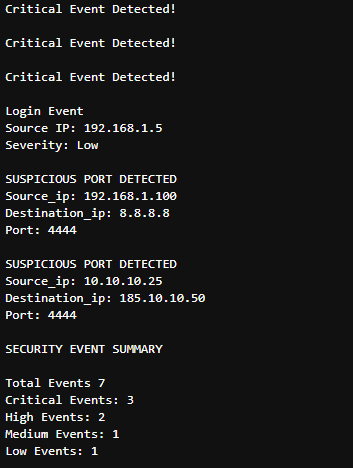

# security_events_analyzer
This is a Python Security Event Analyzer that classifies events, detects suspicious network activity, and generates severity summaries with object oriented programming.

I created this project to apply some core programming concepts to a cybersecurity scenario. The current version uses simulated login, malware, and network events to demonstrate how security data can be represented, analyzed, and categorized using Python.

The long-term goal is to build on this template and eventually process security events generated within my home lab. Future versions could ingest log or alert data from lab systems rather than relying on manually created events.

Current Features:
Models security events using Python classes and inheritance
Supports login, malware, and network event types
Assigns severity levels to security events
Converts severity levels into numerical risk scores
Identifies critical security events
Applies basic decection logic to selected network ports
Counts events by severity
Generates a security event summary

Project Structure

security_events.py contains the class definitions and event-analysis logic.

analyzer.ipynb creates simulated security events, processes them using the classes in security_events.py, applies detection logic, and generates a summary.

Python Concepts Practiced

This project allowed me to apply several Python concepts while building a security-focused application:

Classes and objects
Parent and child classes
Inheritance
__init__ and super()
Methods and attributes
Lists and dictionaries
for loops
if / elif conditionals
Boolean values and return statements
isinstance()
Python modules and imports
f-strings

Security Event Types

LoginEvent

Represents authentication-related activity and stores information such as the source IP address, severity, and username.

MalwareAlert

Represents a malware-related event and stores the source IP address, severity, and detected filename.

NetworkEvent

Represents network activity and stores the source IP address, destination IP address, severity, and destination port.

Network events can also be evaluated against a small demonstration list of ports to practice implementing detection logic.

Example Analysis

The current version creates several simulated security events and processes them through the analyzer.

Example output:

Home Lab Integration Roadmap

The current project serves as a template that I plan to expand for use within my cybersecurity home lab.

a future version could create and analyze events based on actual lab-generated security data.

Potential improvements include:

Reading authentication and system logs
Processing events from CSV or JSON files
Parsing Windows or Linux security events
Processing alerts generated by home-lab security monitoring tools
Automatically assigning event types and severity levels
Expanding detection rules beyond port-based checks
Correlating multiple related events
Adding timestamps to events
Exporting analysis results to reports
Creating statistics from larger collections of events

The goal is to gradually evolve this project from a Python learning exercise into a reusable security-analysis tool for controlled home-lab environments.

Running the Current Version

Clone or download this repository.

Make sure Python 3 and Jupyter are installed.

Open analyzer.ipynb.

Run the notebook cells to generate and analyze the simulated security events.

The current version does not require external Python packages.

Disclaimer

This project is intended for educational and authorized home-lab use. The current security events and associated data are simulated.

Detection logic in this version is intentionally simplified to practice Python and security-analysis concepts. For example, the presence of a particular network port alone does not establish that activity is malicious.

Project Status

Version 1 — Simulated Event Analyzer

The initial version establishes the Python class structure, event-processing workflow, severity analysis, basic detection logic, and reporting format that I plan to build on as my Python and security-analysis skills develop.
